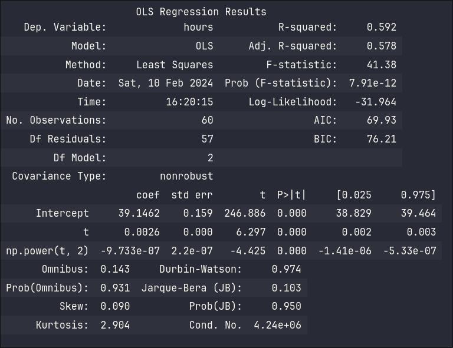

# Stat 5814 Homework 2

## 3.4

### setup

```python
# read the hours dataset into memory
hours = pd.read_csv(os.path.join(cs.DATASETS, "hours.dat"))
# create timestamps for the data
hours.set_index(pd.date_range("1982-07", periods=len(hours.index), freq="M"), inplace=True)
```

### a

```python
# plot the data
plot_ts(hours.index, hours["hours"], "Time (Months)", "Hours", "Plot of Hours Dataset")
```


Trends are difficult to clearly see using only this plot.

### b

```python
# plot the data with unique monthly markers
plot_monthly_markers(
    hours.index, hours["hours"], "Time (Months)", "Hours", "Plot of Hours Dataset"
)
```


Using monthly markers, this data exhibits strong seasonality.
For example, we can see that the number of hours worked always peaks in December

## 3.6

### setup

```python
# read dataset and set timestamp
beersales = pd.read_csv(os.path.join(cs.DATASETS, "beersales.dat"))
beersales.set_index(
    pd.date_range("1975-01", periods=len(beersales.index), freq="M"), inplace=True
)
beersales["month"] = beersales.index.month
beersales["t"] = (beersales.index - beersales.index[0]).days
```

### a

```python
plot_ts(
    beersales.index,
    beersales["beersales"],
    "Time (Months)",
    "Beer Sales (Millions of Barrels)",
    "Millions of Barrels sold in the U.S. from 1975 - 1990",
)
```


Even without monthly markers, this data clearly exhibits a strong level of seasonality. However, we cannot easily see which months repeat.

### b

```python
plot_monthly_markers(
    beersales.index,
    beersales["beersales"],
    "Time (Months)",
    "Beer Sales (Millions of Barrels)",
    "Millions of Barrels sold in the U.S. from 1975 - 1990",
)
```


Using monthly markers, we can see that the number of beer sales peaks in the summer months and decreases in the winter months

### c

```python
model = smf.ols("beersales ~ C(month)", data=beersales).fit()
model.summary()
```


### d

```python
plot_monthly_markers(beersales.index, model.resid_pearson, "Time (Months)", "Residual", "Residual over time")
```


Seasonality across years seems to be gone. Sometimes the Winter months are now on top and the Summer months are on the bottom - or vice versa. However, each year still has many rises and falls int he beer sales. Additionally, the amount of beer sold seems to be increasing with each year.

### e

```python
model = smf.ols("beersales ~ t + np.power(t, 2) + C(month)", data=beersales).fit()
model.summary()
```


### f

```python
plot_monthly_markers(beersales.index, model.resid_pearson, "Time (Months)", "Residual", "Residual over time")
```


Similar to part d, the seasonal component across years is gone. However, this graph seems to have also removed the increasing trend of beer sales, leaving only the rises and falls in each year.

## 3.10

### a

```python
# create time index for estimation
hours["t"] = (hours.index - hours.index[0]).days
model = smf.ols("hours ~ t + np.power(t, 2)", hours).fit()
model.summary()
```



### b

```python
plot_monthly_markers(hours.index, model.resid_pearson, "Time (Months)", "Residuals", "Residuals over time")
```


These residuals still show the same seasonality from the original hours worked dataset

### c

```python
# 3.10 c
from statsmodels.sandbox.stats.runs import runstest_1samp

z_score, p_value = runstest_1samp(model.resid_pearson, cutoff=0, correction=False)
print(f'Z-score:\t {z_score}')
print(f'p-value:\t {p_value}')
```


The low p-value corresponds to the graph of residuals from part b, indicating that the quadratic least squares model is likely not a good fit for this dataset because the seasonality is preserved.

### d

```python
sm.graphics.tsa.plot_acf(model.resid_pearson, lags=20)
```


The autocorrelation functions shows that the first two lags are significant. The fourth lag also exits the boundary but may not be significant.

### e

```python
plt.figure(figsize=(12, 8))
plt.hist(model.resid_pearson, edgecolor="black")
plt.xlabel("Residual")
plt.ylabel("Frequency")
plt.title("Histogram of Residuals")
plt.show()

with plt.rc_context(plt.rc("figure", figsize=(12, 8))):
    pp = sm.ProbPlot(model.resid_pearson)
pp.qqplot(line="45")

plt.show()
```


The histogram appears to be slightly negatively skewed. The qq-plot seems to have more points on the top right side of the graph than it does on the bottom left.

## 3.12

### a

```python
model = smf.ols("beersales ~ t + np.power(t, 2) + C(month)", data=beersales).fit()
model.summary()
```


### b

```python
from statsmodels.sandbox.stats.runs import runstest_1samp

z_score, p_value = runstest_1samp(model.resid_pearson, cutoff=0, correction=False)
print(f'Z-score:\t {z_score}')
print(f'p-value:\t {p_value}')
```


The small p-value indicates that the residuals till have exhibit a trend

### c

```python
sm.graphics.tsa.plot_acf(model.resid_pearson, lags=20)
```


Some of the lags around 10 exit the boundary by a pretty significant margin. This could also indicate that some trends are apparent in the residuals

### d

```python
plt.figure(figsize=(12, 8))
plt.hist(model.resid_pearson, edgecolor="black")
plt.xlabel("Residual")
plt.ylabel("Frequency")
plt.title("Histogram of Residuals")
plt.show()

with plt.rc_context(plt.rc("figure", figsize=(12, 8))):
    pp = sm.ProbPlot(model.resid_pearson)
pp.qqplot(line="45")

plt.show()
```


Much of the data from the qq-plot appears to follow the red line closely, indicating the residuals closely follow a normal distribution. The histogram also shows this, but additionally indicates that the data is slightly positively skewed

## 3.16

### c

```python
num_points = int((1 - (-1)) / 0.00001) + 1
phi = np.linspace(-1, 1, num_points)
y = (1 + phi) / (1 - phi)
plt.figure(figsize=(12, 4))
plt.plot(phi, y)
plt.xlabel("phi")
plt.ylabel(r"$y = (1 + \phi) / (1-\phi)$")
plt.yscale("log")
```


The process mean appears to get much more difficult to estimate as phi tends closer to +1 or -1. This is shown by the plot trending towards infinity as phi gets close to +1, and the plot trending towards 0 as phi gets close to -1.
