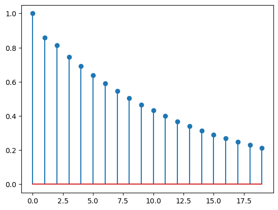
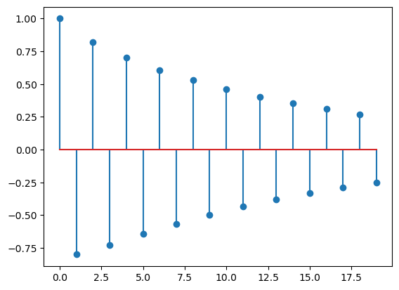
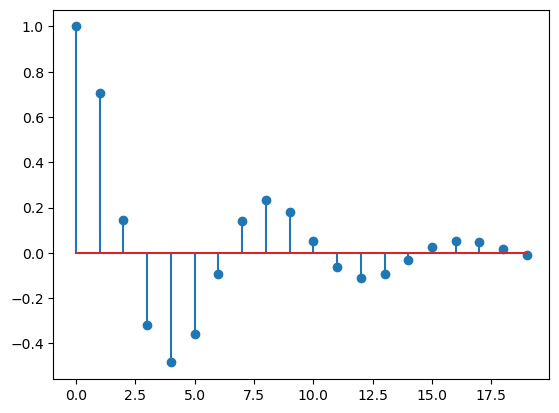
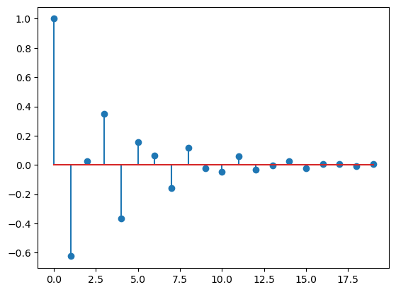
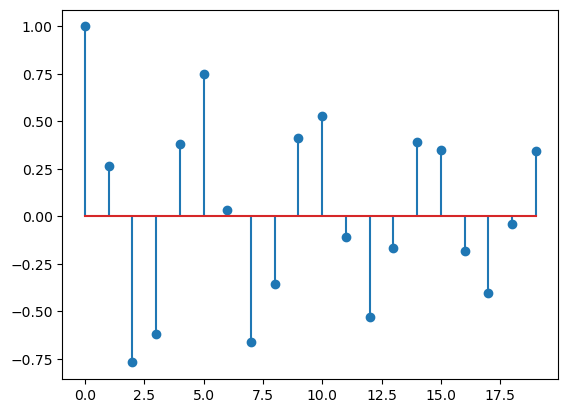
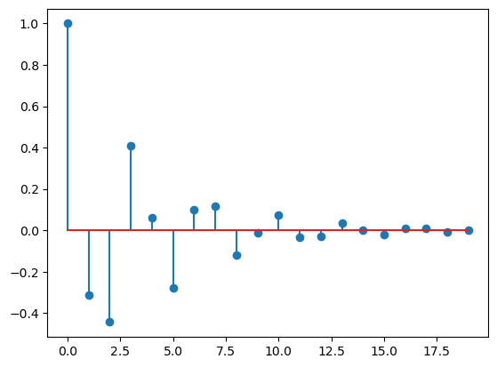

# Stat 5814 Homework 3

## 4.9

### setup

```python
def is_stationary(ar2_model):
    if ar2_model.isstationary:
        print("AR(2) model is stationary")
    else:
        print("AR(2) model is not stationary")


def get_damping_factor(phi_2):
    return np.sqrt(-phi_2)


def get_frequency(phi_1, phi_2):
    return np.arccos(phi_1 / (2 * np.sqrt(-phi_2)))


def get_results(results):
    if np.iscomplexobj(results):
        print(f"AR(2) model has complex roots: {results}")
        print(f"Damping factor = {get_damping_factor(results[1])}")
        print(f"Frequency = {get_frequency(results[0], results[1])}")
    else:
        print(f"AR(2) model has real roots: {results}")
```

### A

```python
ar_coefs = [1, -0.6, -0.3] # phi1 and phi2
ma_coef = [1] # lag 0 coefficient (must be specified in python)
ar2 = ArmaProcess(ar_coefs, ma_coef)
lags = 20
get_results(ar2.arroots)
acf = ar2.acf(lags)
plt.figure()
plt.stem([i for i in range(lags)], acf)
```

AR(2) model is stationary

AR(2) model has real roots: [-3.081666 1.081666]



### B

```python
ar_coefs = [1, 0.4, -0.5] # phi1 and phi2
ma_coef = [1]
ar2 = ArmaProcess(ar_coefs, ma_coef)
lags = 20
is_stationary(ar2)
get_results(ar2.arroots)
acf = ar2.acf(lags)
plt.figure()
plt.stem([i for i in range(lags)], acf)
```

AR(2) model is stationary

AR(2) model has real roots: [-1.06969385 1.86969385]



### C

```python
ar_coefs = [1, -1.2, 0.7] # phi1 and phi2
ma_coef = [1]
ar2 = ArmaProcess(ar_coefs, ma_coef)
lags = 20
is_stationary(ar2)
get_results(ar2.arroots)
acf = ar2.acf(lags)
plt.figure()
plt.stem([i for i in range(lags)], acf)
```

AR(2) model is stationary

AR(2) model has complex roots: [0.85714286-0.83299313j 0.85714286+0.83299313j]

Damping factor = (0.41114824102234493-1.0130082592154053j)

Frequency = (1.0640874726703968-0.24899197436266096j)



### D

```python
ar_coefs = [1, 1, 0.6]  # phi1 and phi2
ma_coef = [1]
ar2 = ArmaProcess(ar_coefs, ma_coef)
lags = 20
is_stationary(ar2)
get_results(ar2.arroots)
acf = ar2.acf(lags)
plt.figure()
plt.stem([i for i in range(lags)], acf)
```

AR(2) model is stationary

AR(2) model has complex roots: [-0.83333333-0.9860133j -0.83333333+0.9860133j]

Damping factor = (1.0306133567126758-0.47836237069948984j)

Frequency = (1.7024134616319084+0.5278829247170828j)



### E

```python
ar_coefs = [1, -0.5, 0.9]  # phi1 and phi2
ma_coef = [1]
ar2 = ArmaProcess(ar_coefs, ma_coef)
lags = 20
is_stationary(ar2)
get_results(ar2.arroots)
acf = ar2.acf(lags)
plt.figure()
plt.stem([i for i in range(lags)], acf)
```

AR(2) model is stationary

AR(2) model has complex roots: [0.27777778-1.01683362j 0.27777778+1.01683362j]

Damping factor = (0.6230227827341799-0.8160485068815571j)

Frequency = (1.087408485198849+0.21625828636587585j)



### F
```python
ar_coefs = [1, 0.5, 0.6]  # phi1 and phi2
ma_coef = [1]
ar2 = ArmaProcess(ar_coefs, ma_coef)
lags = 20
is_stationary(ar2)
get_results(ar2.arroots)
acf = ar2.acf(lags)
plt.figure()
plt.stem([i for i in range(lags)], acf)
```

AR(2) model is stationary

AR(2) model has complex roots: [-0.41666667-1.22190652j -0.41666667+1.22190652j]

Damping factor = (0.9240295220939838-0.6611837044532854j)

Frequency = (1.4267679873417782+0.5251995546192628j)

