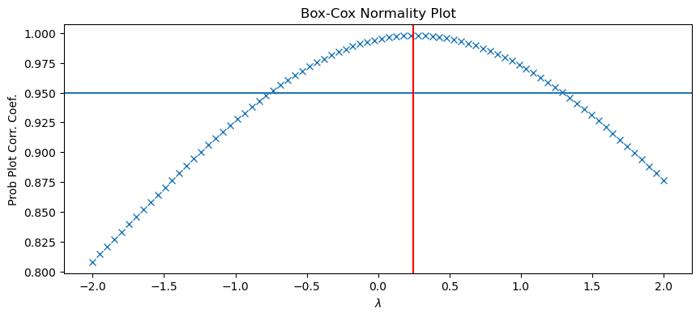
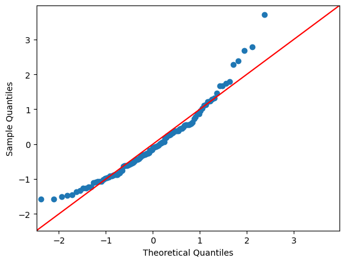
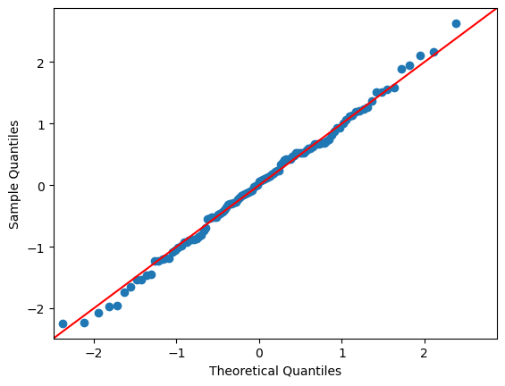
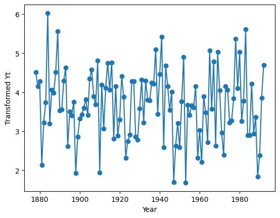
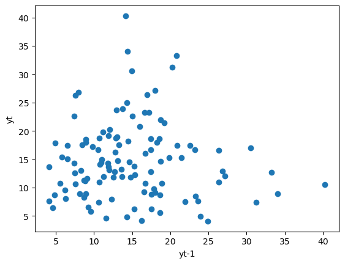
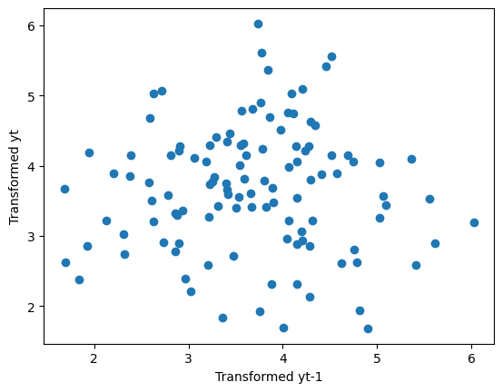
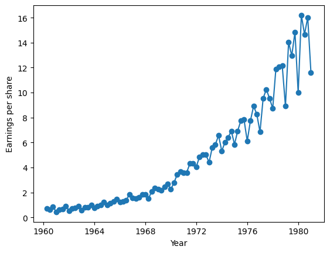
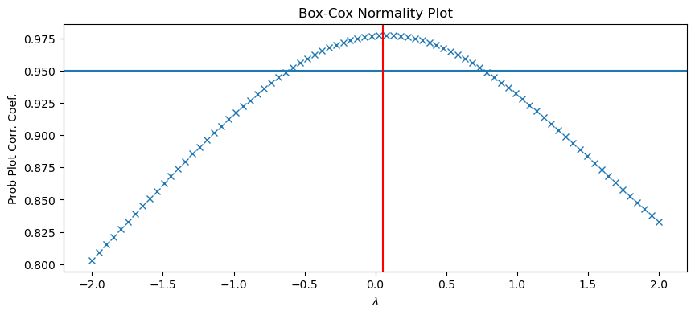
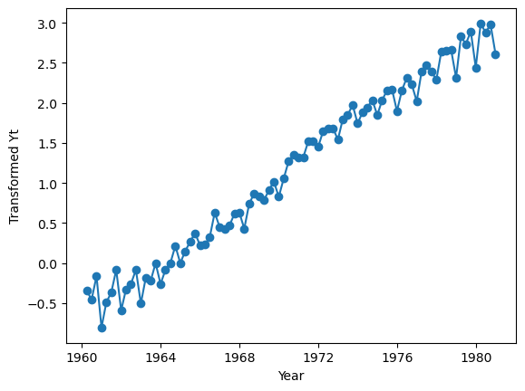
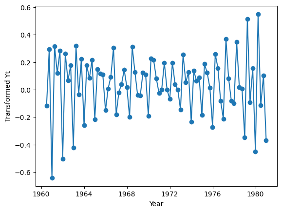

# Stat 5814 Homework 4

## 5.14

### Setup

```python
# 5.14 setup
data = pd.read_csv("../datasets/larain.dat")
data.index = pd.date_range(
    "1878", periods=len(data), freq="Y"
).year  # add timestamp from exhibit 1.1
```

### A

```python
fig = plt.figure(figsize=(10, 4))
ax = fig.add_subplot()
transform, lambda_fit = stats.boxcox(data["larain"])
print(f"best lambda = {lambda_fit}")
stats.boxcox_normplot(data["larain"], -2, 2, plot=ax)  # plot the fitted values
ax.axhline(0.95)  # confidence interval
ax.axvline(lambda_fit, color="r")  # plot best lambda value
```



The best value of lambda was found to be 0.246

### B

```python
sm.qqplot(data["larain"], fit=True, line="45") # original plot
sm.qqplot(transform, fit=True, line="45") #transformed plot
```

QQ plot of the original dataset:



QQ plot of the transformed dataset:



From these plots, we see that the transformed data more closely follows a normal distribution than the original dataset.

### C

```python
data["transform_values"] = transform
plt.xlabel("Year")
plt.ylabel("Transformed Yt")
plt.plot(data.index, data["transform_values"], marker="o")
```



### D

```python
data["larain_shift"] = data["larain"].shift(1) # get yt-1
plt.xlabel("yt-1")
plt.ylabel("yt")
plt.plot(data["larain_shift"], data["larain"], marker="o", linestyle='none')

plt.figure()
data["shifted_transformed_values"] = data["transform_values"].shift(1) # get yt-1
plt.xlabel("Transformed yt-1")
plt.ylabel("Transformed yt")
plt.plot(data["shifted_transformed_values"], data["transform_values"], marker="o", linestyle='none')
```

Original Y<sub>t-1</sub> vs Y<sub>t</sub> plot:



Transformed Y<sub>t-1</sub> vs Y<sub>t</sub> plot:



Comparing these plots, we can see that the dependence of Y<sub>t</sub> on previous values of itself has not been affected by the transformation

## 5.15

### Setup

```python
data = pd.read_csv("../datasets/JJ.dat")
data.index = pd.date_range("1960-01", periods=len(data), freq="Q")
```

### A

```python
plt.plot(data.index, data["JJ"], marker="o")
plt.ylabel("Earnings per share")
plt.xlabel("Year")
```



The data exhibits seasonality and is exponentially increasing

### B

```python
fig = plt.figure(figsize=(10, 4))
ax = fig.add_subplot()
transform, lambda_fit = stats.boxcox(data["JJ"])
print(f"best lambda = {lambda_fit}")
stats.boxcox_normplot(data["JJ"], -2, 2, plot=ax)  # plot the fitted values
ax.axhline(0.95)  # confidence interval
ax.axvline(lambda_fit, color="r")  # plot best lambda value
```



The best value of lambda was found to be 0.051

### C

```python
data["transform_values"] = transform
plt.xlabel("Year")
plt.ylabel("Transformed Yt")
plt.plot(data.index, data["transform_values"], marker="o")
```



No, this plot does not suggest that a stationary model is appropriate because the transformed data still contain a linearly increasing trend and exhibit a small degree of seasonality.

### D

```python
diff = data["transform_values"].diff().dropna()
plt.xlabel("Year")
plt.ylabel("Transformed Yt")
plt.plot(data.index[1:], diff, marker="o")
```



The linear trend from the previous plot is removed but there stilll appears to be some seasonal pattern in the differenced values. This data may need to be differenced twice before a stationary model can be fit.
