# Stat 5814 Homework 5

## Steven Thompson

## 6.20

### A

```python
from statsmodels.tsa.arima_process import ArmaProcess
import numpy as np

np.random.seed(123)

# 6.20 a
# AR(1) n=48, phi=0.7
ar_1 = ArmaProcess(ar=[1, -0.7], ma=[1])
samples = ar_1.generate_sample(48)
# theoretical acf out to 5 lags
acf_t = ar_1.acf(lags=6)
for i, v in enumerate(acf_t):
    print(f"Theoretical ACF({i}) = {v:.3f}")
```

    Theoretical ACF(0) = 1.000
    Theoretical ACF(1) = 0.700
    Theoretical ACF(2) = 0.490
    Theoretical ACF(3) = 0.343
    Theoretical ACF(4) = 0.240
    Theoretical ACF(5) = 0.168

### B

```python
# 6.20 b
import numpy as np
from statsmodels.tsa.stattools import acf

def r1_std_dev(n, phi):
    return np.sqrt((1 / n) * (1 - phi**2))


def r5_std_dev(n, phi):
    return np.sqrt((1 / n) * ((1 + phi**2) / (1 - phi**2)))

# Calculate sample acf
acf_s = acf(samples, nlags=5)
for i, v in enumerate(acf_s):
    print(f"Sample ACF({i}) = {v:.3f}")

t1, t5 = acf_t[1], acf_t[5]
r1, r5 = acf_s[1], acf_s[4]
r1_std_err = r1_std_dev(48, 0.7)
r5_std_err = r5_std_dev(48, 0.7)
print(f"r1 std deviation = {r1_std_err:.3f}")
print(f"r5 std deviation = {r5_std_err:.3f}")
```

    Sample ACF(0) = 1.000
    Sample ACF(1) = 0.750
    Sample ACF(2) = 0.550
    Sample ACF(3) = 0.462
    Sample ACF(4) = 0.316
    Sample ACF(5) = 0.142
    r1 std deviation = 0.103
    r5 std deviation = 0.247

Analysis using equations 6.1.5 and 6.1.6 are shown in the handwritten pdf.

### C

```python
# 6.20 c

# theoretical acf out to 5 lags
ar_1 = ArmaProcess(ar=[1, -0.7], ma=[1])
samples = ar_1.generate_sample(48)
acf_t = ar_1.acf(lags=6)
acf_s = acf(samples, nlags=5)
for i, v in enumerate(acf_s):
    print(f"Sample ACF({i}) = {v:3f}")

t1, t5 = acf_t[1], acf_t[5]
r1, r5 = acf_s[1], acf_s[4]
r1_std_err = r1_std_dev(48, 0.7)
r5_std_err = r5_std_dev(48, 0.7)
print(f"r1 std deviation = {r1_std_err:.3f}")
print(f"r5 std deviation = {r5_std_err:.3f}")

```

    Sample ACF(0) = 1.000000
    Sample ACF(1) = 0.622437
    Sample ACF(2) = 0.428134
    Sample ACF(3) = 0.329097
    Sample ACF(4) = 0.204791
    Sample ACF(5) = 0.303691
    r1 std deviation = 0.103
    r5 std deviation = 0.247

The precisions of the estimate in both cases is still within 1 standard deviation of the theoretical ACF values, showing that while there some variability, the estimates, on average, are good.

### D

```python
# 6.20 d
import seaborn as sns
import matplotlib.pyplot as plt

r1_list = []
r5_list = []
for i in range(10000):
    ar_1 = ArmaProcess(ar=[1, -0.7], ma=[1])
    samples = ar_1.generate_sample(48)
    acf_s = acf(samples, nlags=5)
    r1_list.append(acf_s[1])
    r5_list.append(acf_s[4])

sns.set_style("darkgrid")
fig, ax = plt.subplots(1, 2, figsize=(10, 5))
sns.histplot(r1_list, stat="frequency", ax=ax[0])
ax[0].set_title("Historgram of r1")
sns.histplot(r5_list, stat="frequency", ax=ax[1])
ax[1].set_title("Histogram of r5")
plt.tight_layout()
```

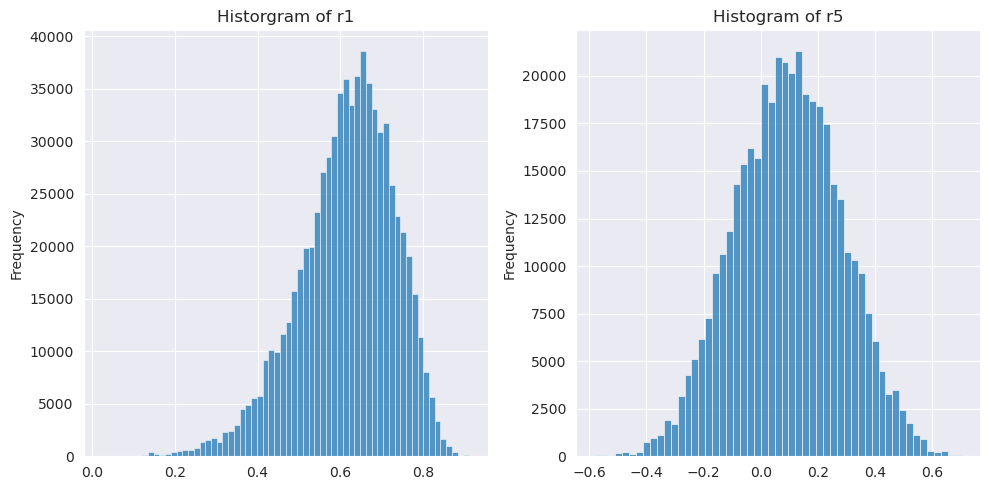

The standard deviation of r1 according to equation 6.1.5 is 0.10. The theoretical value of r1 is 0.7. From the histogram, we can see that the majority of estimates fall within this range. However, there is a large variance with many values falling within 2 standard deviations.

The standard deviation of r5 according to equation 6.1.6 is 0.25. The theoretical value of r5 is 0.168. From the histogram, we can see that the vast majority of sample estimates fall within 1 standard deviation of the theoretical value. Estimates of r5 have less variance than r1.

## 6.28

### A

```python
# 6.28 a
from statsmodels.tsa.arima_process import ArmaProcess
import numpy as np

np.random.seed(123)
ma_2 = ArmaProcess(ar=[1], ma=[1, -0.7, 0.4])
acf_t = ma_2.acf(lags=21)
for i, v in enumerate(acf_t):
  print(f"Theoretical ACF({i}) = {v:.3f}")

```

    Theoretical ACF(0) = 1.000
    Theoretical ACF(1) = -0.594
    Theoretical ACF(2) = 0.242
    Theoretical ACF(3) = 0.000
    Theoretical ACF(4) = 0.000
    Theoretical ACF(5) = 0.000
    Theoretical ACF(6) = 0.000
    Theoretical ACF(7) = 0.000
    Theoretical ACF(8) = 0.000
    Theoretical ACF(9) = 0.000
    Theoretical ACF(10) = 0.000
    Theoretical ACF(11) = 0.000
    Theoretical ACF(12) = 0.000
    Theoretical ACF(13) = 0.000
    Theoretical ACF(14) = 0.000
    Theoretical ACF(15) = 0.000
    Theoretical ACF(16) = 0.000
    Theoretical ACF(17) = 0.000
    Theoretical ACF(18) = 0.000
    Theoretical ACF(19) = 0.000
    Theoretical ACF(20) = 0.000

### B

```python
# 6.28 b
from statsmodels.graphics.tsaplots import plot_acf
from statsmodels.tsa.stattools import acf

samples = ma_2.generate_sample(36)
acf_s = acf(samples, nlags=20)

plot_acf(samples, lags=20)

```

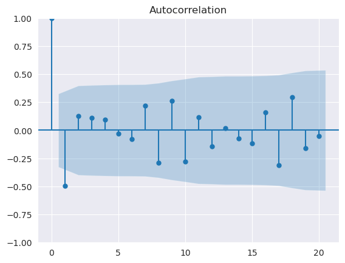

The simulated sample only indicates lag 1 is significant, but the theoretical acf indicates that up to lag 2 is significant. Futhermore, sample values at lags past 2 are not strictly zero but they are all insignificant

### C

```python
# 6.28 c
import seaborn as sns
import matplotlib.pyplot as plt

sns.set_style("darkgrid")

pacf_t = ma_2.pacf(lags=21)
plt.stem(range(len(pacf_t)), pacf_t)
plt.xlabel('Lags')
plt.ylabel('Partial Autocorrelation')
plt.title('Theoretical PACF for MA(2) process')

```

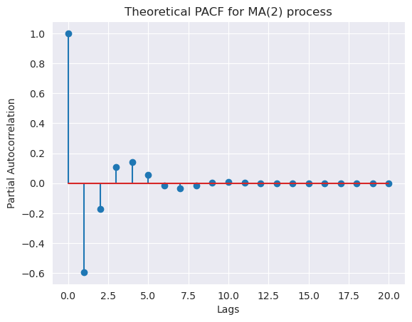

### D

```python
# 6.28 d
from statsmodels.graphics.tsaplots import plot_pacf
plot_pacf(samples)
```

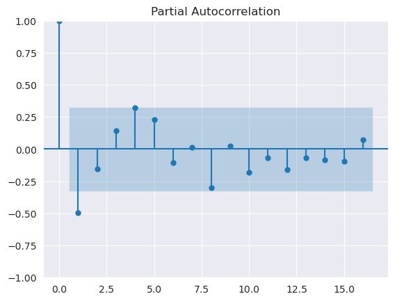

The sample partial autocorrelation follows a similar trend to the theoretical autocorrelation. This shows that the sample fits well.

## 6.30

### A

```python
# 6.30 a
from statsmodels.tsa.arima_process import ArmaProcess
import matplotlib.pyplot as plt
import numpy as np

np.random.seed(123)
arma_11 = ArmaProcess(ar=[1, -0.8], ma=[1, -0.4])
acf_t = arma_11.acf(lags=21)
plt.stem(
    range(len(acf_t)),
    acf_t,
)
plt.xlabel("Lags")
plt.ylabel("Autocorrelation")
plt.title("Theoretical ACF for ARMA(1,1) process")
```

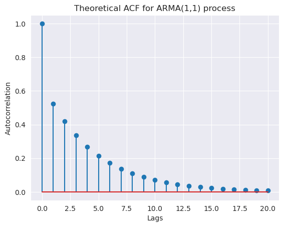

### B

```python
# 6.30 b
from statsmodels.graphics.tsaplots import plot_acf

fig, ax = plt.subplots()
samples = arma_11.generate_sample(nsample=100)
plot_acf(samples, lags=20)

```

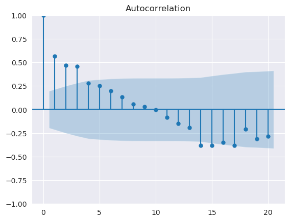

The sample acf decays much more quickly than the theoretical acf.

### C

```python
# 6.30 c
from eacf import eacf
eacf(samples)

```

    AR / MA
      0  1  2  3  4  5  6  7  8  9  10 11 12 13
    0  x  x  x  x  x  o  o  o  o  o  o  o  o  x
    1  x  o  x  o  o  o  o  o  o  o  o  o  o  x
    2  x  x  o  o  o  o  o  o  o  o  o  o  o  o
    3  x  o  o  o  o  o  o  o  o  o  o  o  o  o
    4  x  x  o  o  o  o  o  o  o  o  o  o  o  o
    5  x  x  o  o  o  o  o  o  o  o  o  o  o  o
    6  o  o  o  o  o  o  o  o  o  o  o  o  o  o
    7  o  x  x  x  o  o  o  o  o  o  o  o  o  o

The wedge at (1,1) indicates an ARMA(1,1) process is appropriate

### D

```python
# 6.30 d
from statsmodels.graphics.tsaplots import plot_acf
from eacf import eacf

eacf(samples)
fig, ax = plt.subplots()
samples = arma_11.generate_sample(nsample=100)
plot_acf(samples, lags=20)
```

    AR / MA
      0  1  2  3  4  5  6  7  8  9  10 11 12 13
    0  x  x  x  x  x  o  o  o  o  o  o  o  o  x
    1  x  o  x  o  o  o  o  o  o  o  o  o  o  x
    2  x  x  o  o  o  o  o  o  o  o  o  o  o  o
    3  x  o  o  o  o  o  o  o  o  o  o  o  o  o
    4  x  x  o  o  o  o  o  o  o  o  o  o  o  o
    5  x  x  o  o  o  o  o  o  o  o  o  o  o  o
    6  o  o  o  o  o  o  o  o  o  o  o  o  o  o
    7  o  x  x  x  o  o  o  o  o  o  o  o  o  o

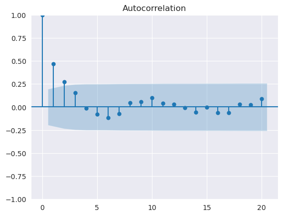

The results are very similar to parts b and c

### E

```python
# 6.30 e

from statsmodels.graphics.tsaplots import plot_acf
from eacf import eacf

eacf(samples)
fig, ax = plt.subplots()
samples = arma_11.generate_sample(nsample=48)
plot_acf(samples, lags=20)
```

    AR / MA
      0  1  2  3  4  5  6  7  8  9  10 11 12 13
    0  x  x  o  o  o  o  o  o  o  o  o  o  o  o
    1  o  o  o  o  o  o  o  o  o  o  o  o  o  o
    2  o  o  o  o  o  o  o  o  o  o  o  o  o  o
    3  o  x  x  o  o  o  o  o  o  o  o  o  o  o
    4  x  x  x  o  o  o  o  o  o  o  o  o  o  o
    5  x  x  o  x  o  o  o  o  o  o  o  o  o  o
    6  x  x  o  x  o  o  o  o  o  o  o  o  o  o
    7  x  x  x  x  o  o  o  o  o  o  o  o  o  o

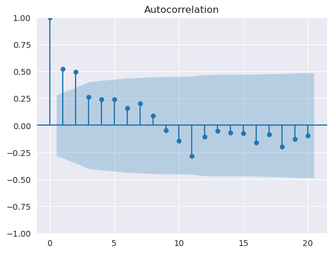

The acf decays at a similar rate to the model with 100 samples.
The eacf does not always suggest an ARMA(1,1) process is appropriate. In this case, an AR(1) model is suggested

### F

```python
# 6.30 f

from statsmodels.graphics.tsaplots import plot_acf
from eacf import eacf

eacf(samples)
fig, ax = plt.subplots()
samples = arma_11.generate_sample(nsample=200)
plot_acf(samples, lags=20)
```

    AR / MA
      0  1  2  3  4  5  6  7  8  9  10 11 12 13
    0  x  x  o  o  o  o  o  o  o  o  o  o  o  o
    1  x  o  o  o  o  o  o  o  o  o  x  o  o  o
    2  x  o  o  o  o  o  o  o  o  o  x  o  o  o
    3  x  o  o  o  o  o  o  o  o  o  o  o  o  o
    4  x  x  x  o  o  o  o  o  o  o  o  o  o  o
    5  x  o  o  o  o  o  o  o  o  o  x  o  o  o
    6  x  x  o  o  o  o  o  o  o  o  x  o  o  o
    7  x  o  o  o  o  o  o  o  o  o  x  o  o  o

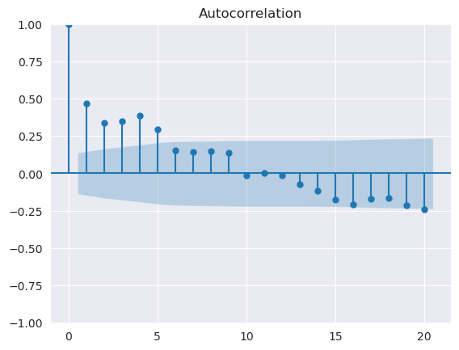

The acf plot takes longer to decay than cases with fewer samples
The eacf indicates an ARMA(1,1) process is sufficient

## 6.35

### A

```python
# 6.35 a
import pandas as pd
from statsmodels.tsa.stattools import adfuller

df = pd.read_csv("../datasets/deere3.dat")

ax = df.plot()
ax.set_title("Plot of deere3 dataset")
ax.set_xlabel("Time")

result = adfuller(df["deere3"])
print(f"ADF Statistic: {result[0]}")
print(f"p-value: {result[1]}")
print("Critical Values:")
for key, value in result[4].items():
    print(f"\t{key}: {value}")

```

    ADF Statistic: -4.11843812100417
    p-value: 0.0009027456101120887
    Critical Values:
    	1%: -3.560242358792829
    	5%: -2.9178502070837
    	10%: -2.5967964150943397

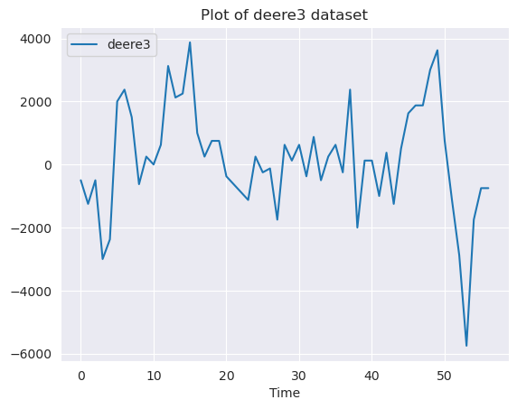

The time seriers plot appears to be stationary but there is a significant drop a little past 50 time units.

The ADF test indicates that a stationary model is appropriate because the ADF statistic is more negative than the critical values and the p-value < 0.05. Therefore, the null hypothesis can be rejected.

### B

```python
# 6.35 b
from statsmodels.graphics.tsaplots import plot_acf, plot_pacf

plot_pacf(df["deere3"], lags=20)
plot_acf(df["deere3"], lags=20)

```

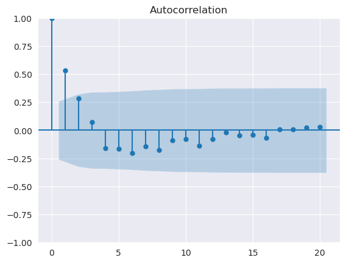

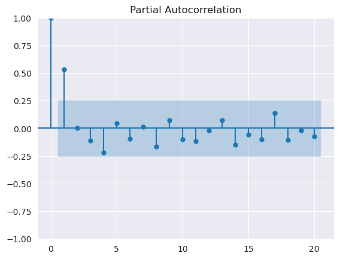

The PACF indicates an AR(1) model.
The ACF indicates an MA(1) model.
Therefore, an ARMA(1,1) model may be appropriate.

## 6.36

### A

```python
# 6.36 a
import pandas as pd
from statsmodels.tsa.stattools import adfuller

df = pd.read_csv("../datasets/robot.dat")
ax = df.plot()
ax.set_title("Plot of robot dataset")
ax.set_xlabel("Time")

result = adfuller(df["robot"])
print(f"ADF Statistic: {result[0]}")
print(f"p-value: {result[1]}")
print("Critical Values:")
for key, value in result[4].items():
    print(f"\t{key}: {value}")

```

    ADF Statistic: -2.8810644606753137
    p-value: 0.0475946682432813
    Critical Values:
    	1%: -3.4514843502727306
    	5%: -2.8708485956333556
    	10%: -2.571729625657462

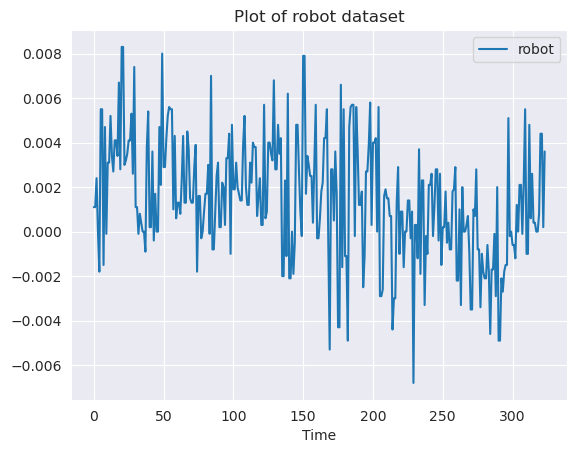

The data has more significant variations in the second half of collection. This may affect the stationarity of the data.

However, the p-value from the ADF test is < 0.05. Therefore, the null hypothesis can be rejected as an indication that the data is stationary.

### B

```python
# 6.36 b
from statsmodels.graphics.tsaplots import plot_acf, plot_pacf

plot_acf(df["robot"], lags=20)
plot_pacf(df["robot"], lags=20)

```

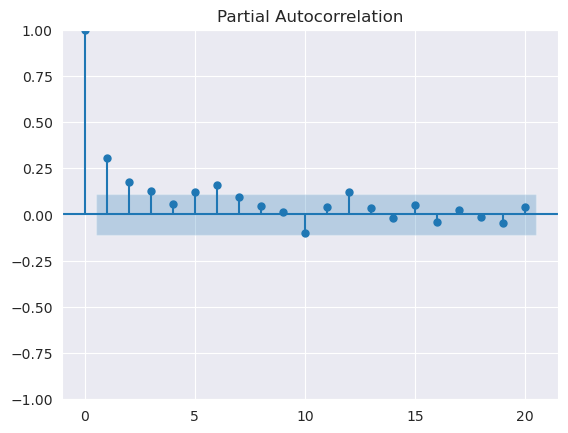

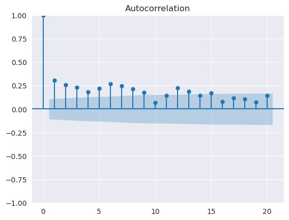

The PACF may suggest an AR(2) or AR(3) process but neither plot is very clear.

### C

```python
# 6.36 c
from eacf import eacf

eacf(df["robot"])
```

    AR / MA
      0  1  2  3  4  5  6  7  8  9  10 11 12 13
    0  x  x  x  x  x  x  x  x  x  o  x  x  x  x
    1  x  o  o  o  o  o  o  o  o  o  o  o  o  o
    2  x  x  o  o  o  o  o  o  o  o  o  o  o  o
    3  x  x  o  o  o  o  o  o  o  o  o  o  o  o
    4  x  x  x  x  o  o  o  o  o  o  o  o  x  o
    5  x  x  x  o  o  o  o  o  o  o  o  o  x  o
    6  x  o  o  o  o  x  o  o  o  o  o  o  o  o
    7  x  o  o  x  o  x  x  o  o  o  o  o  o  o

The eacf shows a wedge at (1,1), indicating an ARMA(1,1) may be sufficient

```python
%%capture
%run armasubsets.py
```

### D

```python
# 6.36 d
armasubsets(y=df["robot"], nar=10, nma=10, y_name="robot")
```

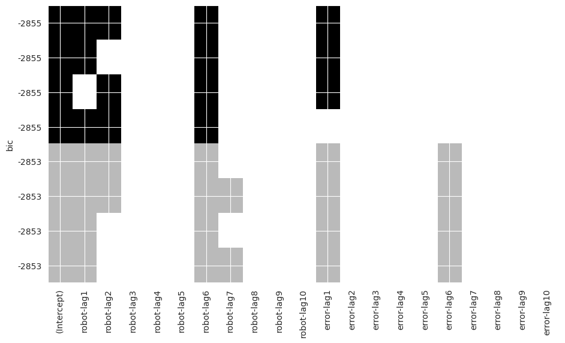

This indicates an ARMA(1,1) model because robot-lag1 and error-lag1 both have the same BIC level. These results agree with the eacf.
